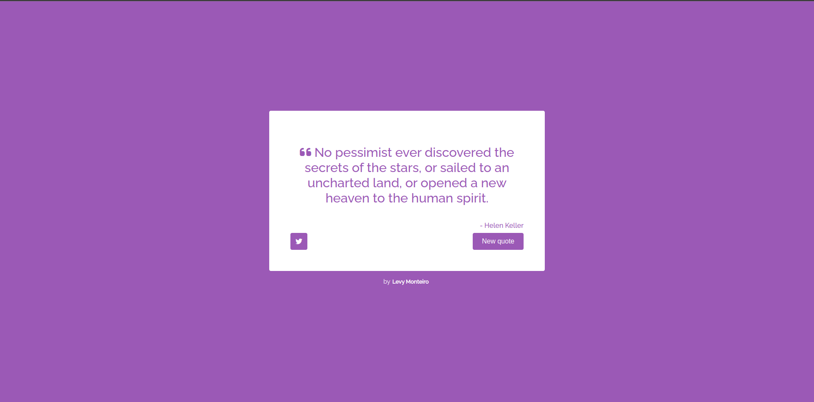

# Random Quote Machine
This is an app that generates random quotes every time you click on 'new quote' button or reload the page.

## Getting Started
To view the website, simply visit the live URL <a href="https://random-quote-machine-levymonteiro.vercel.app/" target="_blank">here.</a>

If you'd like to run the website locally on your machine, you can do so by following these steps:
<ol>
<li>Clone the repository to your local machine using <code>git clone https://github.com/LevyMonteiro/random-quote-machine.git</code>.</li>
<li>Change to directory using <code>cd random-machine-quote</code>.</li>
<li>Run using <code>npm start</code></li>
</ol>

## Built With
This website was built using the following technologies:
<ul>
<li>HTML</li>
<li>CSS</li>
<li>Javascript</li>
<li>React</li>
</ul>

## Reference
This page has as reference the project of <a href="https://www.freecodecamp.org/learn" target="_blank">freeCodeCamp.<a> 
And using an <a href='https://api.quotable.io/random' target='_blank'>API</a> to generate the quotes.

## Author
<ul>
<li>Levy Monteiro - <a href="https://github.com/LevyMonteiro" target="_blank">GitHub</a></li>
</ul>

## Demo
Click on the image to check out a short video demonstrating the app in action:

